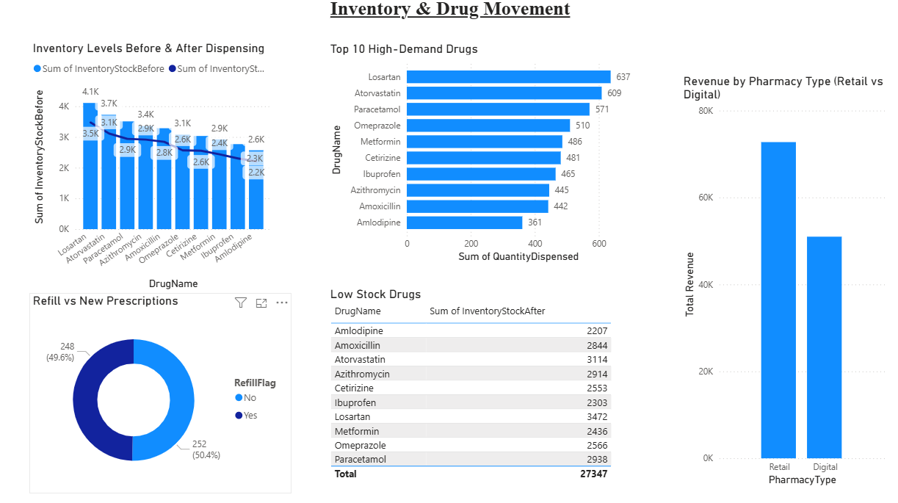
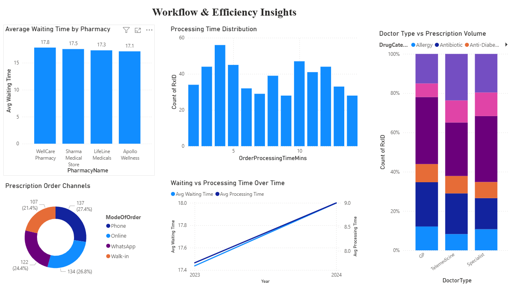

# 📊 Pharmacy Performance Dashboard

An interactive Power BI dashboard analyzing pharmacy operations, drug performance, patient demographics, workflow efficiency, and inventory movement. Designed to reflect real operational analytics work performed for two independent pharmacies in India.

---

## 📁 Dataset  
`pharmacy_operations_dataset.csv`  
Includes:
- Prescription date  
- Drug name & category  
- Quantity dispensed  
- Revenue, cost & profit  
- Patient age & gender  
- Waiting & processing time  
- Inventory before/after  
- Refill patterns  
- Mode of order (Walk-in / Phone / WhatsApp / Online)

---

## 🧮 Key Measures (DAX)
- Total Revenue  
- Total Cost  
- Total Profit  
- Total Prescriptions  
- Avg Waiting Time  
- Avg Processing Time  

---

## 📊 Dashboard Pages

### ⭐ 1. Pharmacy Performance Overview
- Revenue & profit KPIs  
- Top drugs  
- Category revenue  
- Retail vs digital pharmacy mix  
- Patient demographic insights  

---

### ⭐ 2. Inventory & Drug Movement
- Inventory before vs after dispensing  
- High-demand drugs  
- Low-stock alerts  
- Refill patterns  
- Revenue by pharmacy type  

---

### ⭐ 3. Workflow & Efficiency Insights
- Waiting time by pharmacy  
- Processing time distribution  
- Order channel analysis  
- Doctor type analysis  
- Workflow efficiency trends  

---

## 🛠 Tools Used
- Power BI Desktop  
- Power Query  
- DAX  
- CSV dataset  

---

## 🚀 Project Impact
This dashboard demonstrates the ability to:
- Analyze pharmacy operational performance  
- Detect high-demand drugs  
- Identify low-stock risks  
- Understand patient & doctor behavior  
- Improve workflow efficiency  
- Communicate insights visually  

---

